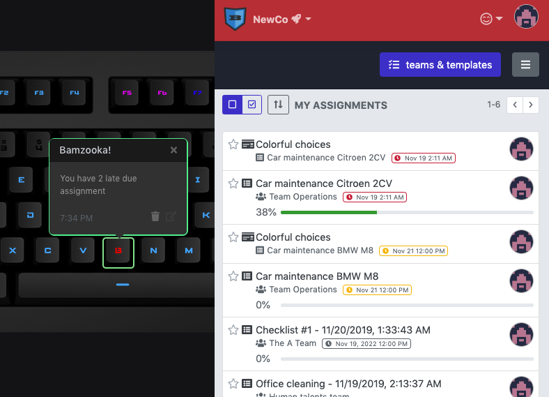

# Q Applet: Bamzooka!

Create checklists, schedule them, assign them to your team, watch progress
in real-time.

This applet displays a notification for Bamzooka assignments on 
a Das Keyboard Q device.

- red assigment due date is late
- orange assignment is due soon
- blue assignment is due later
- green no assignments to complete

To get started, signup for a Bamzooka account at <https://bamzooka.com>

## Changelog

[CHANGELOG.MD](CHANGELOG.md)

## Installation

Requires a Das Keyboard Q Series: www.daskeyboard.com and a Bamzooka account.

Installation, configuration and uninstallation of applets is done within
the Das Keyboard Q application (https://www.daskeyboard.com/q)

## Running tests

- `yarn test`

## Contributions

Pull requests welcome.

## Copyright / License

Copyright 2014 - 2019 Das Keyboard / Metadot Corp.

Licensed under the GNU General Public License Version 2.0 (or later);
you may not use this work except in compliance with the License.
You may obtain a copy of the License in the LICENSE file, or at:

   http://www.gnu.org/licenses/old-licenses/gpl-2.0.txt

Unless required by applicable law or agreed to in writing, software
distributed under the License is distributed on an "AS IS" BASIS,
WITHOUT WARRANTIES OR CONDITIONS OF ANY KIND, either express or implied.
See the License for the specific language governing permissions and
limitations under the License.
